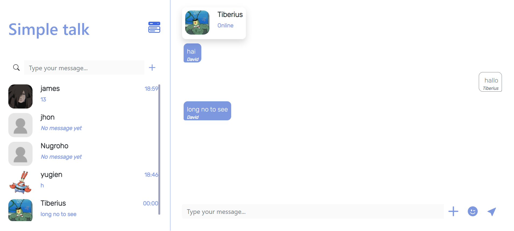

<h1 align='center'>React JS - Simple Talk Front-End</h1>
  <p align="center">
    <a href="https://simple-talk.netlify.app">View Demo</a>
    ·
    <a href="https://github.com/Timotius-NugrohoFrontEnd-Simple-Talk/issues">Report Bug</a>
    ·
    <a href="https://github.com/Timotius-Nugroho/FrontEnd-Simple-Talk/pulls">Request Feature</a>
  </p>



## About The Project

Simple talk is a chat application that can connect everyone in the world very easily. Simple talk is a dynamic and responsive application with the user's device.

## Built With

[](https://github.com/facebook/react)
[](https://github.com/react-bootstrap/react-bootstrap)

## Requirements

1. <a href="https://nodejs.org/en/download/">Node Js</a>
2. Node_modules `npm install` or `yarn install`
3. Backend API : Simple talk - backEnd [`here`](https://github.com/Timotius-Nugroho/BackEnd-Simple-Talk)

## Getting Started

1. Download this Project or you can type `git clone https://github.com/Timotius-Nugroho/FrontEnd-Simple-Talk`
2. Open app's directory in CMD or Terminal
3. Type `npm install` or `yarn install`
4. Add .env file at root folder project

```sh
REACT_APP_BASE_URL = [Backend API]
REACT_APP_IMAGE_URL = [for calling image from server]
REACT_APP_SOCKET_URL = [Socket.io URL]
```

5. Type `npm start`

## Acknowledgements

- [Axios](https://www.npmjs.com/package/axios)
- [Redux](https://redux.js.org/)
- [React](https://reactjs.org/)
- [React Bootstrap](https://react-bootstrap.github.io/)
- [Socket](https://socket.io/)

## License

© [Timotius Nugroho](https://github.com/Timotius-Nugroho/)
